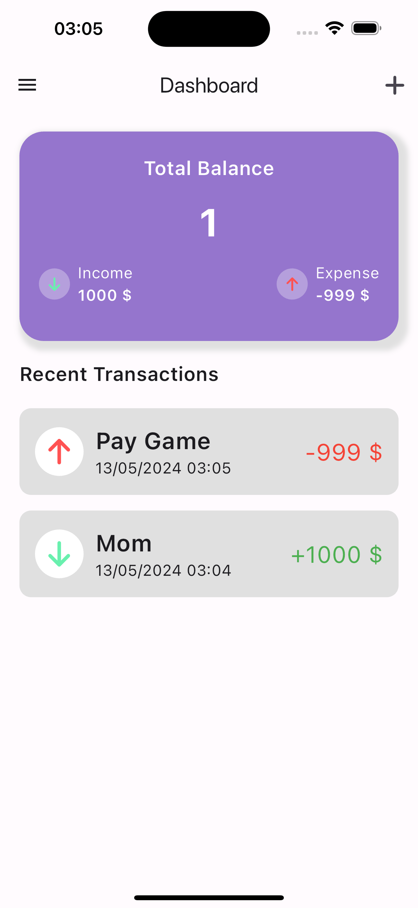

# Expense Tracker
Helping to record income and expenses

## Demo
<div>
  
  
</div>

## Tech Stack
- Golang
- Flutter

## How to use
### Dotenv
```
DB_HOST=
DB_NAME=
DB_PORT=
DB_USERNAME=
DB_PASSWORD=
JWT_SECRET_KEY=
```
### Run
```
$ cd api

$ docker compose up -d --build

$ run app
```